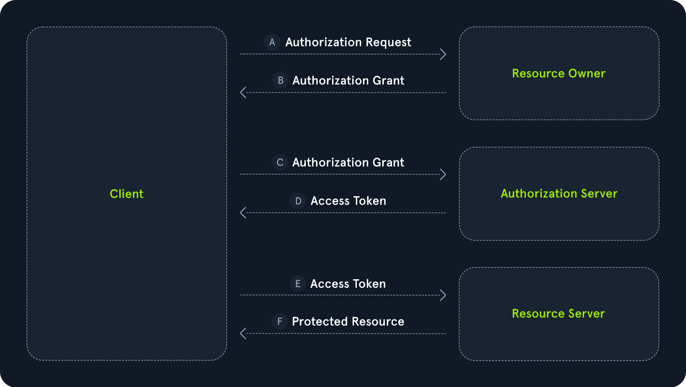
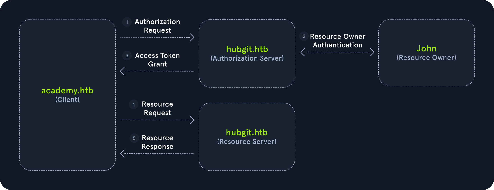
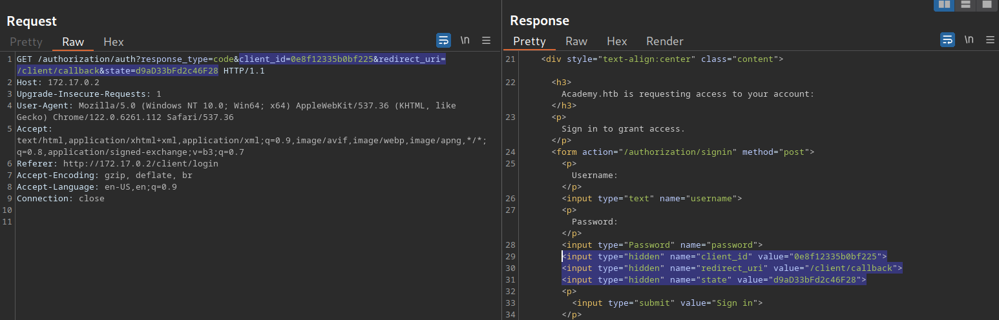

# OAuth

## OAuth Entities

The OAuth protocol comprises the following acting entities:

- `Resource Owner`: The entity that owns the resource. This is typically the user
- `Client`: The service requesting access to the resource on behalf of the resource owner
- `Authorization Server`: The server that authenticates the resource owner and issues access tokens to the client
- `Resource Server`: The server hosting the resources the client requests to access

### Communication flow between entities

1. The client requests authorization from the resource owner
2. The client receives an authorization grant from the resource owner
3. The client presents the authorization grant to the authorization server
4. The client receives an access token from the authorization server
5. The client presents the access token to the resource server
6. The client receives the resource from the resource server



## Authorization Code Grant
1. Authorization Request
```http
GET /auth?client_id=1337&redirect_uri=http://academy.htb/callback&response_type=code&scope=user&state=a45c12e87d4522 HTTP/1.1 
Host: hubgit.htb

```
This request contains multiple interesting GET parameters:

- `client_id`: A unique identifier for the client `academy.htb`
- `redirect_uri`: The URL to which the browser will be redirected after a successful authorization by the resource owner
- `response_type`: This is always set to code for the authorization code grant
- `scope`: This indicates what resources the client academy.htb needs to access. This parameter is optional
- `state`: A random nonce generated by the client that serves a similar purpose to a CSRF token tying the authorization request to the following callback request. This parameter is optional

2. Resource Owner Authentication

The authorization server `hubgit.htb` will request the user to log in and authorize the client `academy.htb` to access the requested resources.

3. Authorization Code Grant

The authorization server redirects the browser to the URL specified in the `redirect_uri` parameter of the authorization request:
```http
GET /callback?code=ptsmyq2zxyvv23bl&state=a45c12e87d4522 HTTP/1.1
Host: academy.htb

```

This request contains two parameters:

- `code`: The authorization code issued by the authorization server
- `state`: The state value from the authorization request to tie these two requests together

4. Access Token Request

After obtaining the authorization code, the client requests an access token from the authorization server:
```http
POST /token HTTP/1.1
Host: hubgit.htb

client_id=1337&client_secret=SECRET&redirect_uri=http://academy.htb/callback&grant_type=authorization_code&code=ptsmyq2zxyvv23bl
```

In addition to the previously discussed parameters, this request contains two new parameters:

- `client_secret`: A secret value assigned to the client by the authorization server during the initial registration. This value authenticates the client to the authorization server
- `grant_type`: This is always set to `authorization_code` for the authorization code grant

5. Access Token Grant
6. Resource Request

## Implicit Grant



1. Authorization Request

The implicit grant type starts with a slightly different authorization request compared to the authorization code grant type:
```http
GET /auth?client_id=1337&redirect_uri=http://academy.htb/callback&response_type=token&scope=user&state=a45c12e87d4522 HTTP/1.1 
Host: hubgit.htb
```

The `response_type` parameter is set to `token`. All other parameters retain the same meaning.

2. Resource Owner Authentication
3. Access Token Grant

This step is the main difference from the authorization token grant. Like before, the authorization server redirects the browser to the URL specified in the authorization request's `redirect_uri` parameter. However, instead of providing an authorization code, this redirect already contains the access token in a URL fragment where it can be extracted using suitable client-side JavaScript code:
```http
GET /callback#access_token=RsT5OjbzRn430zqMLgV3Ia&token_type=Bearer&expires_in=3600&scope=user&state=a45c12e87d4522 HTTP/1.1
Host: academy.htb
```
4. Resource Request

## Attacks
### Improper verification of the `redirect_uri` parameter
#### Bypassing
- `http://academy.htb.attacker.htb/callback`
- `http://academy.htb@attacker.htb/callback`
- `http://attacker.htb/callback?a=http://academy.htb`
- `http://attacker.htb/callback#http://academy.htb`

### Missing `state`
When examining an OAuth implementation in the real world, it is crucial to take note of all parameters that are set in the OAuth flow. A particularly interesting target is the `state` parameter in the `authorization` request. **If the parameter is missing, a CSRF attack on the OAuth flow might be possible.** The impact of such an attack can be severe, depending on the concrete utilization of OAuth.

### xss
If we take a look at the authorization request in our lab, we can see that there are three parameters from our request that are reflected as hidden values in the response:

 

 ### Open Redirect & Chaining Vulnerabilities
 To explore this in more detail, let us assume, the OAuth client `academy.htb` hosts its callback endpoint at `http://academy.htb/`callback and implements an open redirect at `http://academy.htb/redirect` that redirects to any URL provided in the GET parameter `url`. Furthermore, the authorization server `hubgit.htb` validates the `redirect_uri` provided in an authorization request by checking it against the whitelisted origin `http://academy.htb/`.

Now, an attacker can exploit this scenario to steal a victim's authorization code by sending a manipulated authorization request to the victim with the following redirect URL:

`http://academy.htb/redirect?u=http://attacker.htb/callback`

This URL passes the authorization server's validation. However, after successful authentication by the user, the authorization code is first sent to `http://academy.htb/redirect`, resulting in a redirect to `http://attacker.htb/callback`. Thus, the attacker obtains the authorization code despite the correctly implemented validation of the `redirect_uri` parameter. 
